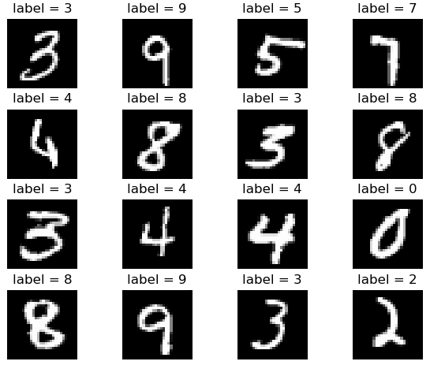

# MNIST-TensorFlow

Deep learning Python programming class

### Dependencies

- Windows 10
- Python 3.6.3: https://www.python.org/downloads/release/python-363/ (Download this file: Windows x86-64 executable installer)
- PyCharm community edition: https://www.jetbrains.com/pycharm/download/#section=windows
- Python package: tensorflow, numpy, matplotlib, sklearn, seaborn, random
- How to install python package: https://packaging.python.org/tutorials/installing-packages/

### Overview

This repository will be used during the Deep learning Python programming class to create:

- Multi-layer perceptron (DNN.py)
- AutoEncoder (AutoEncoder.py)

The goal of these classes is to get a latent space representaiton of this:

